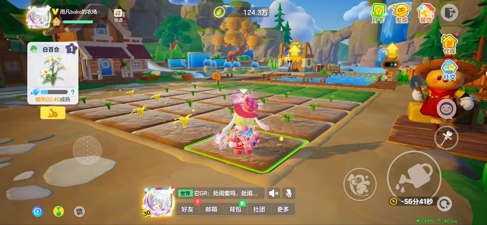

# 元梦浇水计算器

##  简介

这只是一个计算`元梦之星浇水`的完整时间列表，和`简单的闹钟提示`的Kotlin项目

## 配置

所有配置文件在 `com.example.config` 下。通常你只需要改`TimeConfig.kt`中以下两行：

```kotlin
private const val MATURITY_TIME = "2024/8/24 2:56"   // 更改为种菜后第一次浇水的成熟时间
const val CROP_HOURS = 16 // 作物用时，例如玫瑰16h，土豆32h
```

## 使用方法

### 方法一（推荐）

打开`根目录`下的`run.bat`执行文件，看到运行结果类似于则成功：

```bat
Reminder time is in the past!
作物用时：16H
开始时间: 2024/8/23 12:16
成熟时间：2024/8/24 0:00

-----------------------------------
第1次浇水时间: 2024/8/23 12:16<-||->第2次浇水时间: 2024/8/23 17:36<-||->第3次浇水时间: 2024/8/23 22:56<-||->第4次浇水时 间: 2024/8/24 0:00
-----------------------------------
浇水减少用时: 0 04:16
stopTime: 2024/8/24 0:00

```

### 方法二

打开`Intellij IDEA `，构建好`Maven项目`。运行`src\main\kotlin`的`com.example包`下的`PerfectWateringApp.kt`文件，运行结果同`方法一`

## 常见问题

### 问题1: 如何查看成熟时间

**解决方案**:

1. 打开你的`元梦之星`的`星宝农场`

   

2. 记住`当前系统时间`，并结合`成熟时间`，在`TimeConfig.kt`中更改(按照这个例子，`明天`就是`系统时间 + 1天`)：

   ``` kotlin
   private const val MATURITY_TIME = "2024/8/24 2:40"

3. 执行程序。


### 问题2: 如何更改闹钟的音频文件

1. 打开根目录，找到`src\main\resources`文件夹，粘贴你的音频文件（必须是 16 bit的wav文件）

2. 找到`src\main\kotlin`下的`com.example.config`包下的`AudioConfig.kt`，做如下修改：

   ```kotlin
   package org.example.com.example.config
   object AudioConfig {
       const val AUDIO_FILE_PATH = "你的音频文件路径(.wav)"
   }
   ```

3. 运行程序进行测试。
